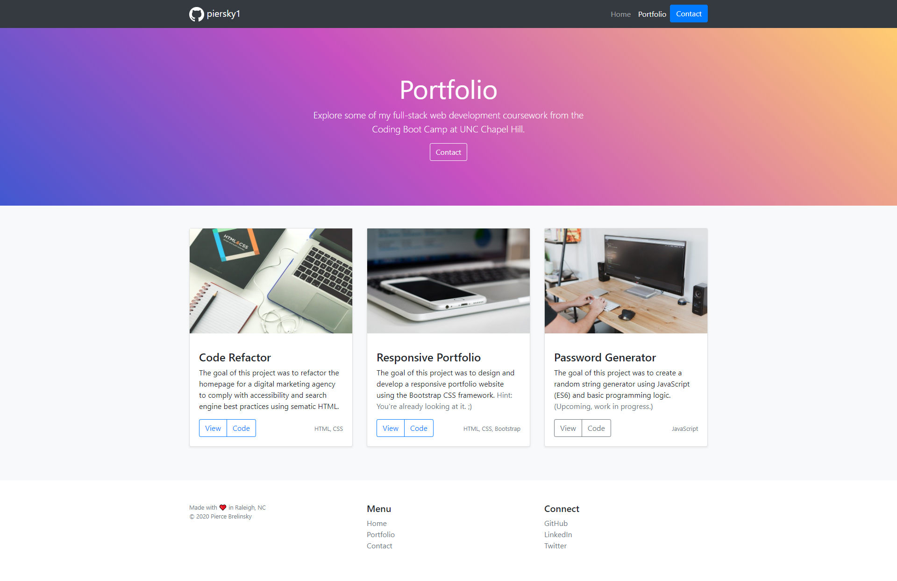

# Unit 02 CSS and Bootstrap Homework: Responsive Portfolio

## Description 

This is a design concept for my own personal, responsive web developer portfolio. It consists of three pages:

* Home

* Portfolio

* Contact

I built this using Bootstrap 4, a popular CSS framework originally from Twitter for creating responsive websites. Check out the official Bootstrap website for help getting started on your own projects: [https://getbootstrap.com/docs/4.5/getting-started/introduction/](https://getbootstrap.com/docs/4.5/getting-started/introduction/)

Bootstrap makes it easy to get a responsive website up and running in minutes with pre-styled components. I made minor tweaks to the HTML and CSS to personalize it. My favorite part was adding the color gradient backgrounds in pure CSS. It gives the site a professional look and feel and reminds me of Apple's color pallete for their marketing and branding (see credits).

Also, on the homepage I linked to IBM's Call for Code for Racial Justice. As an Asian American developer I hope my work can make a positive impact on not only my local community, but the world.

Note, I purposefully did not include canonical links or meta descriptions as this project is only a design concept, for educational use only. I tagged it as "noindex" to avoid being included in search engine result pages.

Refer to [https://github.com/piersky1/homework2/commits/main](https://github.com/piersky1/homework2/commits/main) for a log of all commits.

This project was deployed using GitHub Pages and can be found here: [https://piersky1.github.io/homework2/](https://piersky1.github.io/homework2/)

## Table of Contents

* [Installation](#installation)
* [Usage](#usage)
* [Credits](#credits)
* [License](#license)

## Installation

There are several options to "install" this project yourself:

* Download and deploy the HTML files and assets folder containing the necessary stylesheet and images to your hosting service provider of preference. I recommend GitHub Pages, Heroku, or Netlify as free options.

* Download the files and open the index.html on your local machine.

* Simply view the live application on the web at: [https://piersky1.github.io/homework2/](https://piersky1.github.io/homework2/)

## Usage 

This project is intended for educational purposes only.

## Credits

References:

* [https://getbootstrap.com/docs/4.5/getting-started/introduction/](https://getbootstrap.com/docs/4.5/getting-started/introduction/)
* [https://cssgradient.io/gradient-backgrounds/](https://cssgradient.io/gradient-backgrounds/)

## License

MIT License

Copyright (c) [2020] [Pierce Brelinsky]

Permission is hereby granted, free of charge, to any person obtaining a copy
of this software and associated documentation files (the "Software"), to deal
in the Software without restriction, including without limitation the rights
to use, copy, modify, merge, publish, distribute, sublicense, and/or sell
copies of the Software, and to permit persons to whom the Software is
furnished to do so, subject to the following conditions:

The above copyright notice and this permission notice shall be included in all
copies or substantial portions of the Software.

THE SOFTWARE IS PROVIDED "AS IS", WITHOUT WARRANTY OF ANY KIND, EXPRESS OR
IMPLIED, INCLUDING BUT NOT LIMITED TO THE WARRANTIES OF MERCHANTABILITY,
FITNESS FOR A PARTICULAR PURPOSE AND NONINFRINGEMENT. IN NO EVENT SHALL THE
AUTHORS OR COPYRIGHT HOLDERS BE LIABLE FOR ANY CLAIM, DAMAGES OR OTHER
LIABILITY, WHETHER IN AN ACTION OF CONTRACT, TORT OR OTHERWISE, ARISING FROM,
OUT OF OR IN CONNECTION WITH THE SOFTWARE OR THE USE OR OTHER DEALINGS IN THE
SOFTWARE.

---

## Badges

---

This project was part of my coursework at the UNC Chapel Hill Coding Bootcamp. Full assigment details can be found [here](https://unc.bootcampcontent.com/UNC-Coding-Boot-Camp/unc-ral-fsf-pt-11-2020-u-c/blob/master/01-html-git-css/homework/README.md).